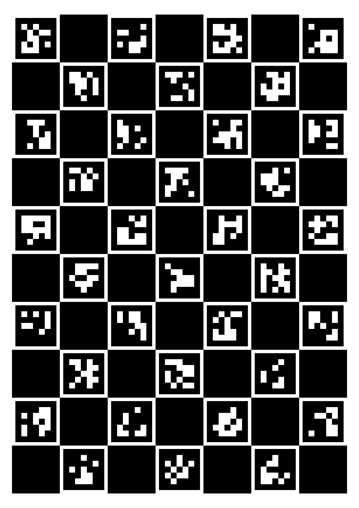

# aruco-camera-calib

Camera caribration tool with [ArUco](https://www.uco.es/investiga/grupos/ava/node/26) library

## Features

- [OpenCV](https://opencv.org/)
- [ChArUco](https://docs.opencv.org/4.5.1/df/d4a/tutorial_charuco_detection.html)

    

## Requirements

- Python 3.7.3
  - numpy 1.21.5
  - pillow 8.4.0
  - pickle-mixin 1.0.2
  - opencv-contrib-python 4.5.1.48

## Installation

    $ git clone git@github.com:takuya-ki/aruco-camera-calib.git; cd aruco-camera-calib
    $ pip install -r requirements.txt

## Usage
Please carefully check the options before executing scripts. `python src/XXX.py --help`

    $ python src/marker_creation.py --dict 'DICT_4X4_250' --num_pixels 64 --num_markers 5 --out_dir ../data/markers/
    $ python src/board_creation.py --dict 'DICT_5X5_100' --out_dir ../data/board --board_name sample_board --square_length 0.028 --marker_length 0.024 --h_margin 5 --v_margin 5 --save_pkl

Set the board configuration parameters manually or give the configuration pickle file path  

    $ python src/board_detection.py --dict 'DICT_5X5_100' --square_length 0.028 --marker_length 0.024 --h_margin 5 --v_margin 5 --in_dir ../data/pictures/sample --camera_param ../data/result/camera_param.pkl 
    $ python src/board_detection.py --input_board_cfg_pkl --board_cfg_pkl_path ../data/board/sample_board.pkl --in_dir ../data/pictures/sample --camera_param ../data/result/camera_param.pkl 

Set the board configuration parameters manually or give the configuration pickle file path  

    $ python src/board_calibration.py --dict 'DICT_5X5_100' --square_length 0.028 --marker_length 0.024 --h_margin 5 --v_margin 5 --in_dir ../data/pictures/capture --out_dir ../data/result --is_print_calib_result --is_undistort
    $ python src/board_calibration.py --input_board_cfg_pkl --board_cfg_pkl_path ../data/board/sample_board.pkl --in_dir ../data/pictures/capture --out_dir ../data/result --is_print_calib_result --is_undistort

## Author / Contributor

[Takuya Kiyokawa](https://takuya-ki.github.io/)

## License

This software is released under the MIT License, see [LICENSE](./LICENSE).
