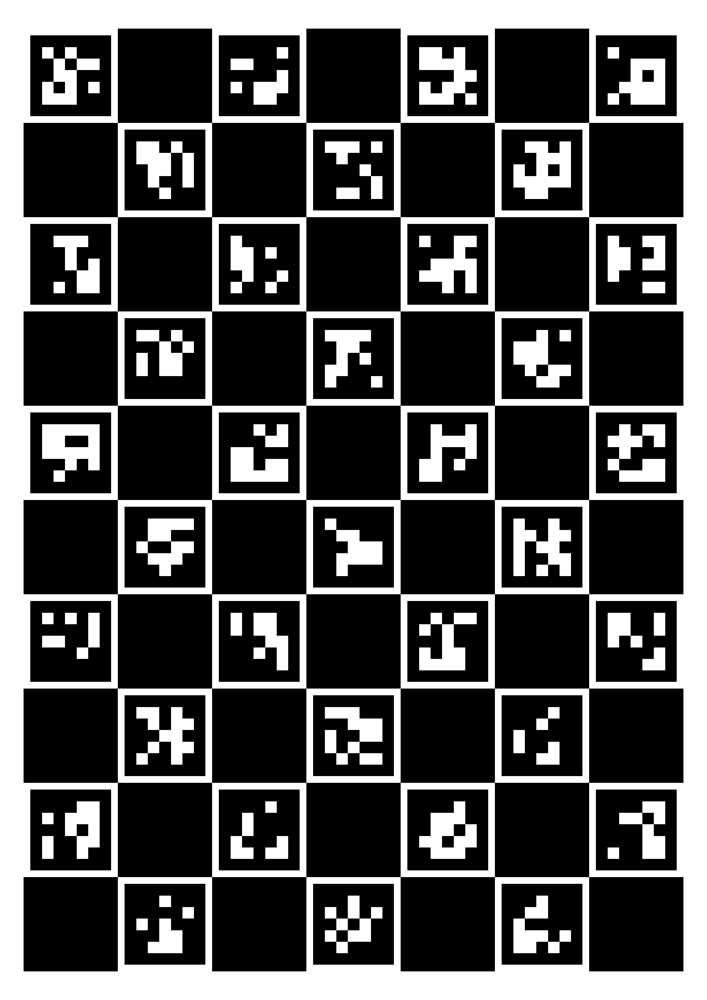

# aruco-camera-calib

Camera caribration tool with ArUco library

## Features

- Programs are executed on [Jupyter Notebook](https://jupyter.org/)
- Use AR library, [ArUco](https://www.uco.es/investiga/grupos/ava/node/26)
- Use Computer Vision library, [OpenCV](https://opencv.org/)
- Calibration with ArUcoboard

    

## Requirements (tested)

- Python 3.7.3
  - numpy 1.21.5
  - pickle-mixin 1.0.2
  - matplotlib 3.1.1
  - opencv-contrib-python 3.4.2.17
  - jupyter 1.0.0
  - pandas 1.1.0
  - pillow 5.4.1

## Installation

	$ git clone git@github.com:takuya-ki/aruco-camera-calib.git
	$ pip install -r requirements.txt

## Usage on jupyter notebook

#### Create aruco markers

    # execute lines of marker_creation.ipynb

#### Create aruco board needed for calibration

    # execute lines of board_creation.ipynb 

#### Detect aruco board in input images

    # execute lines of board_detection.ipynb

#### Calibrate camera with images capturing aruco board

    # place input images under pictures/
    # set csv file path containing board configuration parameters
    # execute lines of board_calibration.ipynb

## Usage of python script

    $ python marker_creation.py   # to create marker pictures
    $ python board_creation.py    # to create a board picture
    $ python board_detection.py   # to detect a board in images
    $ python board_calibration.py # to calibration with images

## Author

[Takuya Kiyokawa](https://takuya-ki.github.io/)

## License

This software is released under the MIT License, see [LICENSE](./LICENSE).
