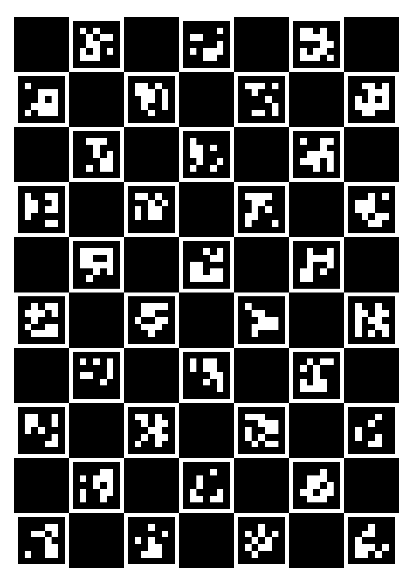

# aruco-camera-calib

Camera caribration tool with ArUco library

## Features

- Programs are executed on [Jupyter Notebook](https://jupyter.org/)
- Use AR library, [ArUco](https://www.uco.es/investiga/grupos/ava/node/26)
- Use Computer Vision library, [OpenCV](https://opencv.org/)
- Calibration with ArUcoboard

    

## Requirements (tested)

- Python 3.7.3
  - numpy 1.21.5
  - pickle-mixin 1.0.2
  - matplotlib 3.1.1
  - opencv-contrib-python 4.5.1.48
  - pandas 1.1.0
  - pillow 8.4.0

## Installation

    $ git clone git@github.com:takuya-ki/aruco-camera-calib.git
    $ pip install -r requirements.txt

## Usage

    $ python scripts/marker_creation.py --dict 'DICT_4X4_250' --num_pixels 64 --num_markers 5 --out_dir ../data/markers/
    $ python script/board_creation.py --dict 'DICT_5X5_100' --out_dir ../data/board --board_name sample_board --square_length 0.028 --marker_length 0.024 --h_margin 5 --v_margin 5 --outcsv
    $ python scripts/board_detection.py   # to detect a board in images
    $ python scripts/board_calibration.py # to calibration with images

## Author

[Takuya Kiyokawa](https://takuya-ki.github.io/)

## License

This software is released under the MIT License, see [LICENSE](./LICENSE).
